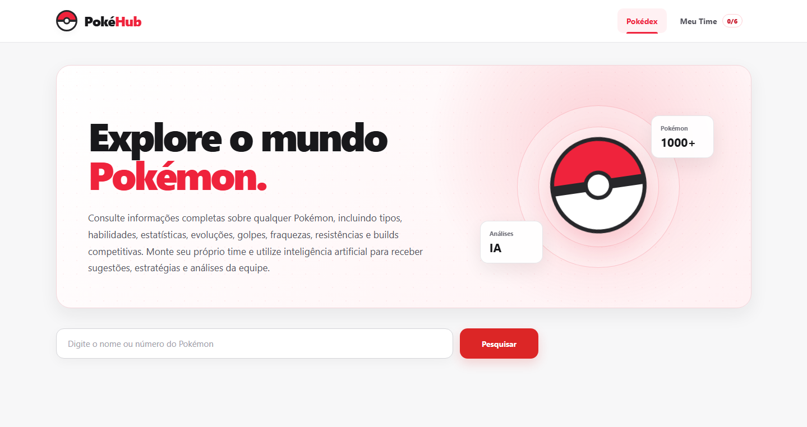

# ⚡ PokéHub

Uma plataforma web moderna para explorar o universo Pokémon, montar equipes competitivas e gerar estratégias utilizando Inteligência Artificial.

O PokéHub integra a **PokéAPI** com o **Google Gemini**, oferecendo uma experiência completa para jogadores casuais e competitivos.

---

## 📸 Preview

<p align="center">
  
</p>

---

# ✨ Funcionalidades

### 🔍 Pokédex Inteligente

- Pesquisa por nome ou número do Pokémon
- Informações completas
- Tipagem
- Estatísticas base
- Habilidades
- Evoluções
- Fraquezas
- Resistências
- Imunidades

---

### ⚔️ Sistema de Movimentos

- Lista completa de golpes
- Busca por nome
- Filtro por geração
- Filtro por método de aprendizado
- Ordenação por:
  - Nome
  - Poder
  - Nível

---

### 🧠 Inteligência Artificial

Assistente especializado em Pokémon utilizando **Google Gemini**.

É possível:

- tirar dúvidas sobre qualquer Pokémon;
- receber recomendações estratégicas;
- entender mecânicas do jogo;
- aprender funções em batalha.

---

### 🛡️ Gerador de Builds

Geração automática de builds competitivas contendo:

- Função
- Nature
- Ability
- Item
- EVs
- Quatro golpes
- Estratégia de utilização

---

### 👥 Team Builder

Monte equipes com até **6 Pokémon**.

Cada integrante pode ser visualizado individualmente.

---

### 📊 Análise de Equipe

A Inteligência Artificial analisa automaticamente:

- nota geral do time;
- sinergia;
- cobertura ofensiva;
- fraquezas compartilhadas;
- pontos fortes;
- sugestões de melhorias.

---

## 🚀 Tecnologias

### Frontend

- React
- TypeScript
- Vite
- Axios
- React Router
- CSS Modules

### Backend

- Node.js
- Express
- TypeScript
- Zod
- Helmet
- Express Rate Limit

### APIs

- PokéAPI
- Google Gemini API

---

# 🏗️ Arquitetura

```
React
   │
Axios
   │
Express API
   │
 ├── PokéAPI
 └── Google Gemini
```

---

# 🛡️ Segurança

O backend foi desenvolvido seguindo boas práticas de segurança.

- Helmet
- CORS configurado
- Rate Limiting
- Validação com Zod
- Variáveis de ambiente
- Limite de tamanho das requisições
- Tratamento de erros
- Health Check

---

# 🎯 Objetivos do projeto

Este projeto foi desenvolvido com o objetivo de aprofundar conhecimentos em:

- Desenvolvimento Full Stack
- Arquitetura de aplicações
- Consumo de APIs REST
- Integração com IA
- TypeScript
- React
- Node.js
- Boas práticas de segurança
- Organização de projetos

---

# 📂 Estrutura

```
PokeHub

├── app
│   ├── src
│   ├── assets
│   └── public
│
├── api
│   ├── src
│   ├── routes
│   ├── services
│   ├── controllers
│   └── middlewares
```

---

# ⚙️ Executando localmente

### Clone o projeto

```bash
git clone https://github.com/M4th3usB0rg3z009/PokeHub.git
```

### Frontend

```bash
cd app

npm install

npm run dev
```

### Backend

```bash
cd api

npm install

npm run dev
```

---

# 📌 Roadmap

- ✅ Pesquisa de Pokémon
- ✅ Informações detalhadas
- ✅ Sistema de movimentos
- ✅ Assistente com IA
- ✅ Gerador de Builds
- ✅ Team Builder
- ✅ Análise de equipes
  
---

# 👨‍💻 Autor

Desenvolvido por **Matheus Borges**

LinkedIn:
*(adicione seu LinkedIn)*

GitHub:
https://github.com/M4th3usB0rg3z009
